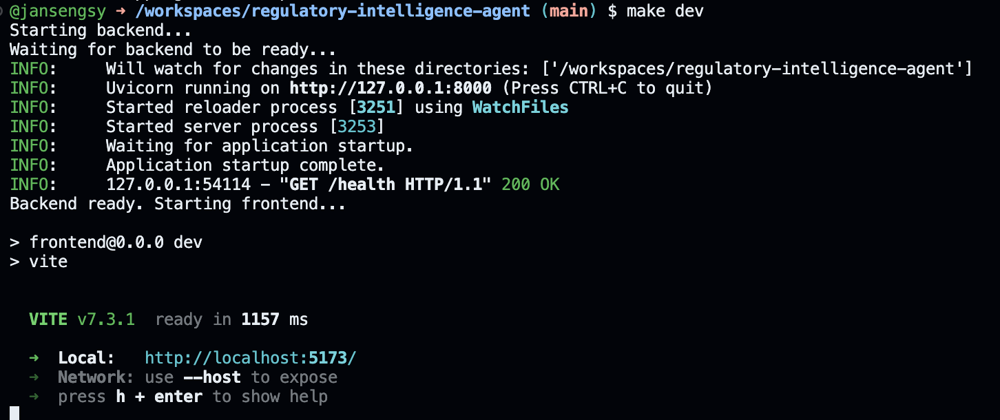

# Regulatory Intelligence & Impact Platform

## What it does:

This prototype tool is able to ingest regulatory announcements from the Guernsey Financial Services Commission via RSS feeds and display them in a simple dashboard UI.

Users are able to trigger ingestion from the feed. Once injested, they can trigger an AI agent to classify each new item giving it:

- Summary
- Severity
- Type
- Category(s)
- Affected sectors
- Subcategory(s)
- A list of actions needed to be taken
- Key entities the LLM may identify
- Effective date

## Why I chose to build this tool

Compliance and regulation within financial services is something teams need to stay on top of. Regulatory changes and updating sanction lists require teams to manually check multiple sources and read through updates to work out what's relevant. I wanted to explore whether an LLM agent could automate some of this work.

**The core goal was to help speed up this process, filter out the noise, and surface insight easily.**

I chose to start with the GFSC because it's the local regulator and already had an RSS feed available.

## The three main steps:

1. **Ingest** regulatory updates from 13 GFSC RSS feeds, skipping duplicates or already fetched updates, and storing those in the db
2. **Classify** each alert using an LLM agent assigning the fields listed above and providing insight
3. **Displays** alerts in a filterable, sortable dashboard with full detail views

Currently, the ingestion and analysis steps are manual. This could be easily improved through automation. We could setup a cron job on the server to schedule automating fetching. This job could, if new updates are found, trigger the agent to run on any new items.

## Check out the app (git codespace):

[](https://codespaces.new/jansengsy/regulatory-intelligence-agent)

I setup the codespace myself as this project uses my Open Router API key and Langfuse for observability and I wanted to avoid you having to set these up and add credits. The `devcontainer.json` also sets up the dependencies and port forwarding to make your life easier.

Feel free to use this as much as you like as you test, the costs are low and I've provisioned a unique API key for the project with restricted spending.

The Codespace comes pre-loaded with regulatory data. Most alerts are already classified. I've left some recent updates out to allow you to see the fetching and analysis happen in real time.

Once the Codespace is ready, open a terminal in the virtual vs code editor and run:

```bash
make dev
```

This starts both the backend API (port 8000) and frontend dev server (port 5173)

When ready, you will see this output:



Click the `Local:` link to view the application.

### What to try

1. The dashboard loads with pre-classified GFSC alerts
2. Click **Fetch Feeds** button to pull the latest RSS data (there should be some new alerts)
3. Click **Analyse Pending (count)** button to run the LLM classification agent
4. Use the filters and sort controls to explore the data
5. Click any alert to view its full classification detail

## Architecture

Tree view was generate using the `tree` unix command. I've annotated key areas to highlight

```
├── Makefile
├── README.md
├── agents                               # LLM agent layer
│   ├── __init__.py                      # Loads env and setup observability for all agents in package
│   ├── observability.py                 # Langfuse tracing
│   └── regulatory                       # The regulation classification agent
│       ├── agent.py                     # Agent definition + analyse function
│       ├── prompt.py                    # System prompt for this agent
│       └── tools.py                     # Agent tools (placeholder but could be expanded)
├── backend                              # FastAPI backend
│   ├── config.py                        # Pydantic settings (env vars + defaults)
│   ├── database.py                      # SQLite/SQLModel setup
│   ├── main.py                          # Backend entry point
│   ├── models.py                        # DB Schemas (only alert used, others are for future improvements)
│   ├── routers
│   │   └── alerts.py                    # /api/alerts endpoints (used by frontend)
│   └── services
│       └── feed_service.py              # RSS feed ingestion and feeds dataclass
├── frontend                             # React frontend (using shadcn, tailwind, vite, ts)
│   ├── components.json                  # Shadcn config
│   ├── eslint.config.js
│   ├── index.html
│   ├── package-lock.json
│   ├── package.json
│   ├── src
│   │   ├── App.tsx
│   │   ├── api.ts                       # Fetch wrapper for API client
│   │   ├── components                   # UI components
│   │   │   ├── AlertDetail.tsx
│   │   │   ├── AlertsList.tsx
│   │   │   ├── ...
│   │   ├── index.css
│   │   ├── lib
│   │   │   └── utils.ts                 # Shared/reusable utilities
│   │   ├── main.tsx
│   │   └── types
│   │       └── index.ts
│   ├── tsconfig.app.json
│   ├── tsconfig.json
│   ├── tsconfig.node.json
│   └── vite.config.ts
├── regsense.db                          # Pre-populated SQLite database
├── requirements.txt
```

## Tech Stack

| Layer         | Technology                                       |
| ------------- | ------------------------------------------------ |
| Backend       | Python, FastAPI, SQLModel (SQLite)               |
| LLM           | Pydantic AI + OpenRouter                         |
| Frontend      | React, TypeScript, Vite, Tailwind CSS, shadcn/ui |
| Observability | Langfuse                                         |
| RSS Ingestion | feedparser                                       |

The stack is lightweight and mostly open source.

### Key Design/tech Decisions

**Multi-agent architecture**

The regulatory classification agent is isolated in its own package (`agents/regulatory/`) with separate files for the agent definition, system prompt, and tools. This makes it straightforward to add additional agents (e.g., portfolio impact, document analysis) without touching the existing code. I chose this structure over a single monolithic agent because each domain (regulatory, portfolio, documents) would need different prompts, tools, and output schemas. By keeping them separate they can evolve independantly while still making use of global tools/setup like the observability.

**Structured LLM output over free-text parsing**

The agent uses Pydantic AI's `output_type` parameter with an `AlertClassification` Pydantic model. This forces the LLM to respond in a validated JSON schema rather than free text. The trade-off is that structured output uses tool calling under the hood, which limits model choice (some models don't support it), but the benefit is that classification results are typed, validated, and map directly to the SQLModel database schema without any manual parsing or post-processing. If the LLM returns invalid data, Pydantic catches it before it hits the database.

**Pydantic AI over LangChain/CrewAI**

I chose Pydantic AI because it's lightweight, type-safe, and integrates naturally with the FastAPI/Pydantic ecosystem. LangChain would have added abstraction overhead for what is fundamentally a single-step classification task. In its current form, this agent doesn't need chains, memory, or complex orchestration. Pydantic AI's `Agent` with `output_type` gave me exactly what I needed with minimal boilerplate.

**Concurrent classification with asyncio.gather**

Each alert classification is independent, one doesn't depend on another. The agent uses `asyncio.gather` to run all LLM calls in parallel rather than sequentially. This means a batch of 10 alerts finishes in roughly the time of a single call instead of 10× that. Failed classifications are caught via `return_exceptions=True`, logged, and skipped without aborting the whole batch. For larger production workloads, a task queue would add persistence and retries, but for this POC, `asyncio.gather` gives a big speedup with minimal code.

**OpenRouter as the LLM gateway**

Rather than calling Anthropic's API directly, I used OpenRouter as an intermediary. This means the model can be swapped by changing a single environment variable (e.g., from Claude Haiku to GPT-4o or a local model) without any code changes. For a production tool, this also provides model fallback options and usage analytics. The trade-off is an additional network hop, but I think the flexibility outweighs the (low) latency cost.

**GFSC currently, with potential to expand into other jurisdictions**

The feed service defines each RSS source as a `FeedSource` dataclass with a URL, category, and jurisdiction. Adding another regulator (e.g., UK FCA) would mean appending to a list, so no structural changes needed. I focused on GFSC specifically because it's the primary regulator for Guernsey-based firms and provides well-structured RSS feeds across 13 categories. The `FeedSource` data class includes a jurisdiction field (defaulting to Guernsey) which I added to have early support for this potential expansion.

**SQLite for the POC**

Zero-config, file-based, and no database server to provision. The trade-off is no concurrent write support, but for a single-user POC this isn't a concern. The migration path to PostgreSQL would be changing one connection string in `config.py` since SQLModel abstracts the engine.

**Feed-based ingestion with deduplication**

RSS is lightweight and doesn't require API keys from regulators. The service deduplicates against existing `link` values in the database, so running fetch multiple times is safe. A production version could add web scraping, email parsing, or direct API integration. The ingestion logic could also be extracted into an agent tool, allowing multiple agents to trigger data collection, or exposed via an MCP server for broader integration.

**Observability as opt-in**

Langfuse tracing is configured in `agents/__init__.py` and fails gracefully if credentials aren't set. This means the app works identically with or without observability. No crashes and no conditional logic scattered through the codebase. When enabled, every LLM call is traced with full input/output, latency, and token usage, which is valuable for debugging classification quality and monitoring costs.

## How I would expand/improve this tool

### Immediate improvements

- **Scheduled ingestion:** Replace manual "Fetch Feeds" with a background scheduler polling RSS feeds on a configurable interval, automatically triggering classification for new items.
- **Retry logic and error handling:** Add retry with exponential backoff for both RSS fetching (network failures) and LLM calls (rate limits, timeouts). Failed classifications should be queued for retry rather than silently skipped.
- **Output validation with [Guardrails AI](https://github.com/guardrails-ai/guardrails):** Add a validation layer on top of LLM classifications to catch hallucinated categories, invalid severity levels, or inconsistent sector assignments before they reach the database.
- **Domain-specific context:** Provide the agent with additional context about the organisation (e.g., which sectors they operate in, current compliance priorities) so it can better determine relevance and severity.
- **Critical alert notifications:** Automatically flag and surface high-severity alerts to avoid reliance on manual checking.
- **Workflow state:** Allow users to mark alerts as "actioned" or "dismissed" to keep the active feed clean.
- **Pagination:** Server-side pagination for the alerts list to handle larger datasets efficiently.
- **PostgreSQL migration:** Swap SQLite for PostgreSQL for production deployment with concurrent access. Could add pgvector for semantic search across alert summaries if the dataset grows large enough to warrant it.

### Feature expansion

- **Document intelligence:** Build a new agent to process uploaded compliance documents (PDFs, policies). [Docling](https://github.com/docling-project/docling) looks promising for structured document extraction, and could feed into an agent that cross-references document content against recent regulatory changes to flag sections needing updates.
- **Portfolio impact analysis:** Cross-reference regulatory alerts against a portfolio of holdings using live market data (yfinance) to estimate which holdings are affected and quantify exposure.
- **Digest emails:** Weekly summaries of regulatory changes delivered by email, so stakeholders who don't use the dashboard still stay informed.
- **Pluggable ingestion:** Extend beyond RSS to support email lists, PDF gazette notices, and direct API integrations. The ingestion logic could be exposed as an MCP server, allowing other tools and agents to trigger data collection.
- **Audit trails:** Full traceability for every classification: which model was used, the complete input/output, token usage, cost, and confidence. Langfuse already captures this.
- **Timeline/calendar view:** Track upcoming effective dates and implementation deadlines from classified alerts.
- **Sanctions cross-referencing:** Automatically check client data against newly published sanctions notices and notify relevant teams.
- **Multi-jurisdiction support:** Add feeds from UK FCA, SEC, and other regulators to broaden coverage.
- **Authentication and RBAC:** Hook into an existing identity provider (e.g., Entra ID) for role-based access control.
- **Additional agents:** Expand the platform with more compliance/due diligence agents. KYC automation would be a natural next step.
